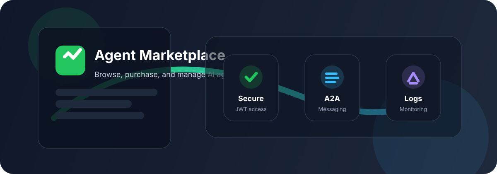

# Agent Marketplace

> A polished marketplace for AI agents with secure authentication, agent-to-agent communication, and live operational logs.


<p align="center">
  
</p>

## Overview

Agent Marketplace is a full-stack demo platform for browsing, purchasing, and querying AI agents. It combines a FastAPI backend with a React dashboard and supports authenticated access, per-agent demo limits, A2A messaging, and structured logging.

## Highlights

| Area               | What you get                                                     |
| ------------------ | ---------------------------------------------------------------- |
| **Agent browsing** | Discover available agents, capabilities, and status in one place |
| **Secure access**  | JWT login, hashed passwords, and purchase-based access keys      |
| **A2A messaging**  | Send messages between agents and inspect the response history    |
| **Live logs**      | Review request, auth, and communication events in real time      |
| **Modern UI**      | React-based interface with modal flows and dashboard panels      |

## Features

- **Three core agents**: Data Analyzer, Query Executive, and Report Generator
- **Demo access**: each user gets 10 free queries per agent before purchase
- **Purchase flow**: buying an agent reveals a unique access key and API URL
- **Access details**: purchased tokens are shown inside the UI without needing a refresh
- **A2A communication**: agents can exchange messages and store history
- **Security headers**: no-store caching and basic browser hardening on API responses
- **Operational logging**: events are captured for authentication, queries, and messaging

## Tech Stack

- **Backend**: FastAPI, Uvicorn, Pydantic, SQLAlchemy, SQLite
- **Auth**: JWT, `bcrypt`, `passlib`, `python-jose`
- **Frontend**: React 18, React Router, Axios, `react-scripts`
- **Integrations**: Groq client for agent responses, dotenv for config

## Project Structure

```text
.
├── backend/
│   ├── main.py
│   ├── inspect_db.py
│   └── requirements.txt
├── frontend/
│   ├── package.json
│   ├── src/
│   │   ├── App.js
│   │   ├── App.css
│   │   └── components/
│   │       ├── AgentGrid.js
│   │       ├── AgentModal.js
│   │       ├── AuthModal.js
│   │       ├── LogsPanel.js
│   │       ├── MainContent.js
│   │       ├── MCPToolsGrid.js
│   │       └── A2APanel.js
│   └── public/
├── agents.py
├── access.py
├── auth.py
├── README.md
└── STATUS_REPORT.md
```

## Quick Start

### Prerequisites

- Python 3.10+
- Node.js 18+
- `pip` and `npm`

### 1) Backend

```bash
cd backend
python -m venv .venv
source .venv/bin/activate
pip install -r requirements.txt
python main.py
```

The API runs on `http://127.0.0.1:8000`.

### 2) Frontend

```bash
cd frontend
npm install
npm start
```

The app runs on `http://localhost:3000`.

### 3) Demo credentials

| Username | Password   |
| -------- | ---------- |
| `admin`  | `admin123` |
| `user1`  | `user123`  |

## Environment Variables

Create a `.env` file in `backend/` if you want to customize the runtime:

```env
SECRET_KEY=replace-with-a-long-random-secret
GROQ_API_KEY=your-groq-key
ALLOWED_ORIGINS=http://localhost:3000,http://127.0.0.1:3000
```

## Core Workflows

### Browse and query agents

1. Sign in with a demo account.
2. Open the agent dashboard.
3. Ask a question against any available agent.
4. Track your demo limit as it decreases.

### Purchase access

1. Click **Purchase** on an agent.
2. Receive a purchase token and access URL.
3. Copy the credentials and reuse them for unlimited access to that agent.

### Use A2A communication

1. Open the A2A panel.
2. Select a source and destination agent.
3. Send a JSON payload.
4. Review the response and the message history.

## API Endpoints

### Authentication

- `POST /auth/login`
- `POST /auth/register`

### Agents

- `GET /agents`
- `GET /agents/{agent_id}`
- `GET /agents/{agent_id}/access-details`
- `POST /agents/{agent_id}/purchase`
- `POST /agents/send-message`
- `GET /agents/{agent_id}/messages`
- `GET /agents/{agent_id}/ask`
- `GET /agents/communication/history`

### Logs

- `GET /logs`
- `GET /logs/events`
- `DELETE /logs`

### Health

- `GET /health`
- `GET /`

## Security Notes

- Tokens are not meant to be passed in URLs.
- Purchased access uses unique UUID-based keys.
- Credentials are only exposed to the authenticated owner.
- Passwords are hashed before storage.
- For production, replace the default secret key and use a real database.

## Contributions

If you want a simple way to check your GitHub activity:

- Open your profile page and review the contribution heatmap.
- Visit `https://github.com/TIRTHANATH20` to see contribution activity.
- Use this repo’s commit history for project-specific activity.

## Roadmap

- Add richer dashboard visuals and screenshots
- Expand agent management and filtering
- Improve log search and export options
- Add tests for the purchase and access flow

## License

This project is licensed under the MIT License. See [LICENSE](LICENSE) for details.
